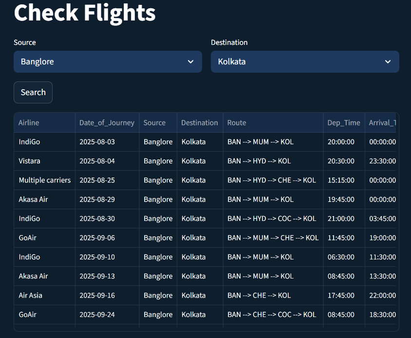
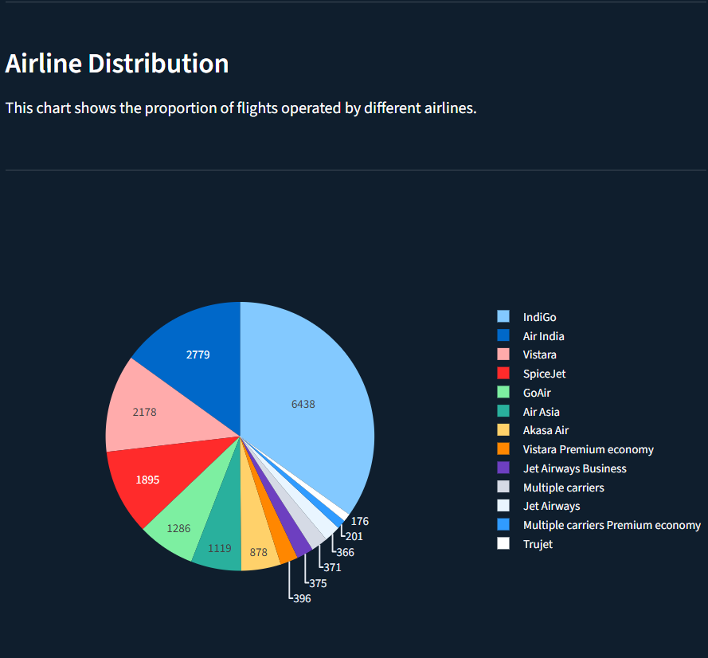
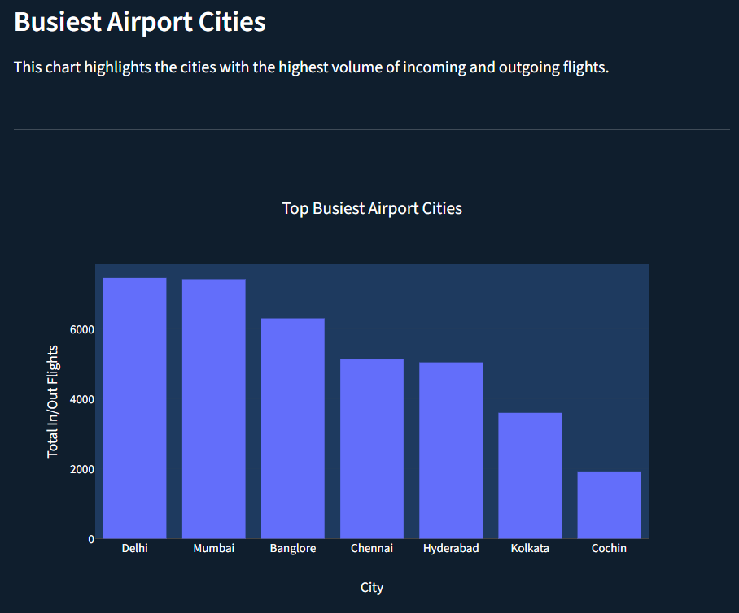
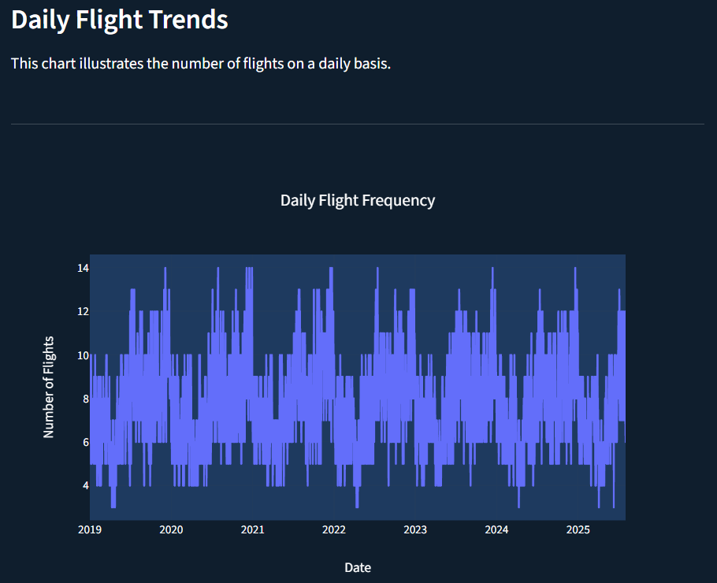

# ✈️ Flight Analytics Dashboard

A modern, interactive web application to **search flights** between Indian cities and visualize **flight trends** using real-time MySQL data and advanced visualizations built with Streamlit and Plotly.

---

## 🚀 Features

### 🔍 Check Flights
- Select source and destination cities
- View upcoming flights, airlines, times, and routes
- Real-time query from MySQL database

### 📊 Analytics Dashboard
- **Airline Distribution**: Pie chart showing airline-wise flight share
- **Busiest Cities**: Bar chart showing airport traffic in major Indian cities
- **Daily Trends**: Line chart showing historical flight frequency

---

## 🧱 Tech Stack

| Layer         | Technology |
|--------------|------------|
| Backend       | Python, MySQL |
| Web Framework | Streamlit |
| Visualization | Plotly |
| Image Support | Pillow |
| Data Handling | Pandas |

---

## 📷 UI Preview

### 🛫 Flight Search

### 📈 Analytics
#### Airline Distribution | Busiest Airport Cities | Daily Trends

---

